# CareerOnTrack Mobile Application

## Goal

Build a scalable, maintainable, and user-centric React Native mobile application for career goal tracking that demonstrates enterprise-level architecture patterns, component reusability, and a comprehensive theming system that enhances user experience across different contexts and preferences.


## App Overview

CareerOnTrack is a career development application that enables users to set, track, and manage their professional goals. The app provides a clean, intuitive interface for goal management with features including:

* **User Authentication**: Secure login with JWT-based session management.
* **Goal Management**: Create, view, update, and delete career goals.
* **Progress Tracking**: Visual progress indicators and status management.
* **Dashboard**: Overview of goal statistics and recent activities.
* **Profile Management**: User profile editing and preferences.
* **Theme Customization**: Light, dark, and system-based theme switching.

## Screenshots & Demo

### Light Theme

| Screen | Screenshot |
|--------|-----------|
| **Login Screen** | 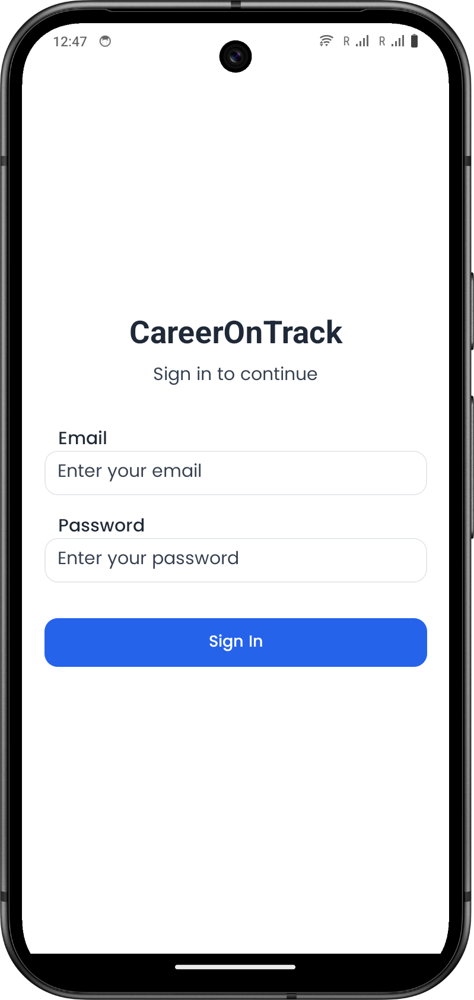 |
| **Login Screen (Validation)** | 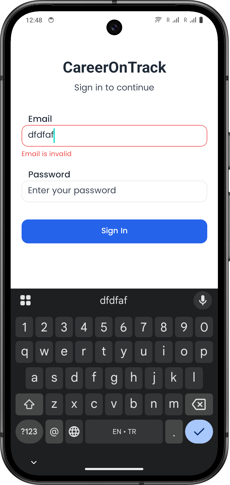 |
| **Home Dashboard** | 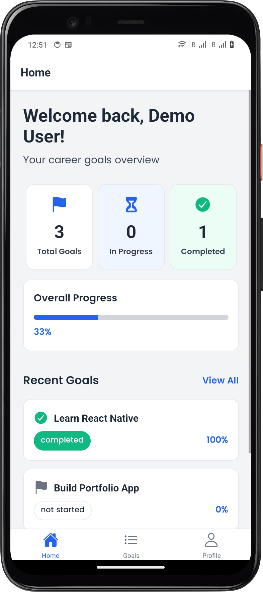 |
| **Goals List** | 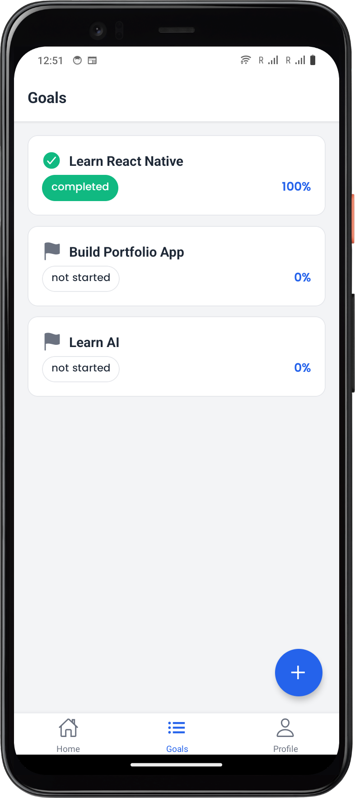 |
| **Goal Detail** | 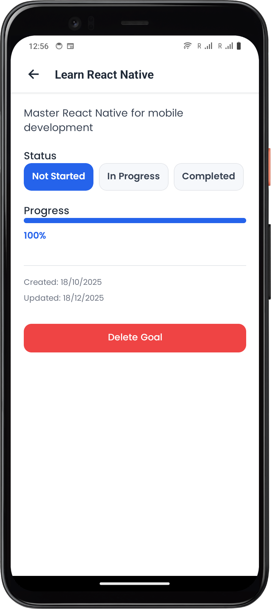 |
| **Profile Screen** | 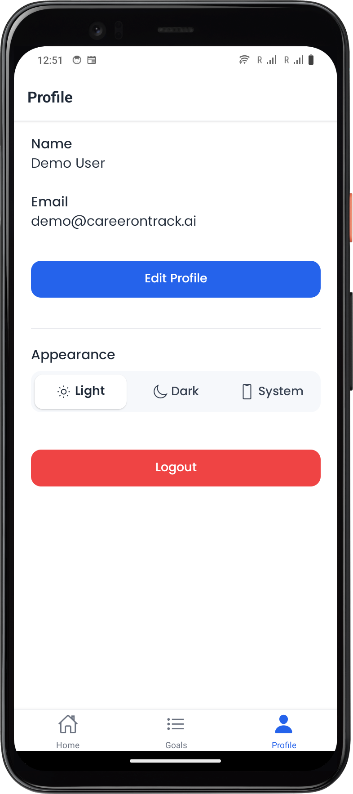 |

### Dark Theme

| Screen | Screenshot |
|--------|-----------|
| **Login Screen** | 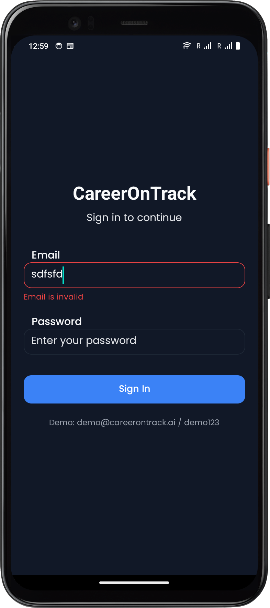 |
| **Login Screen (Validation)** | 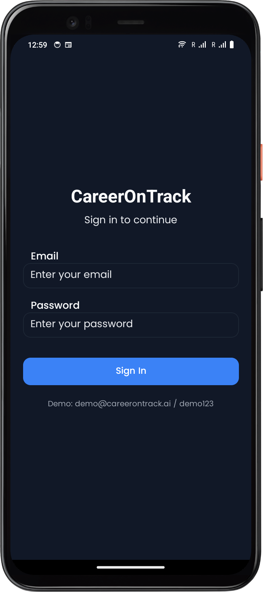 |
| **Home Dashboard** | 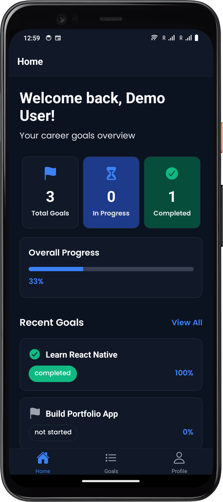 |
| **Goals List** | 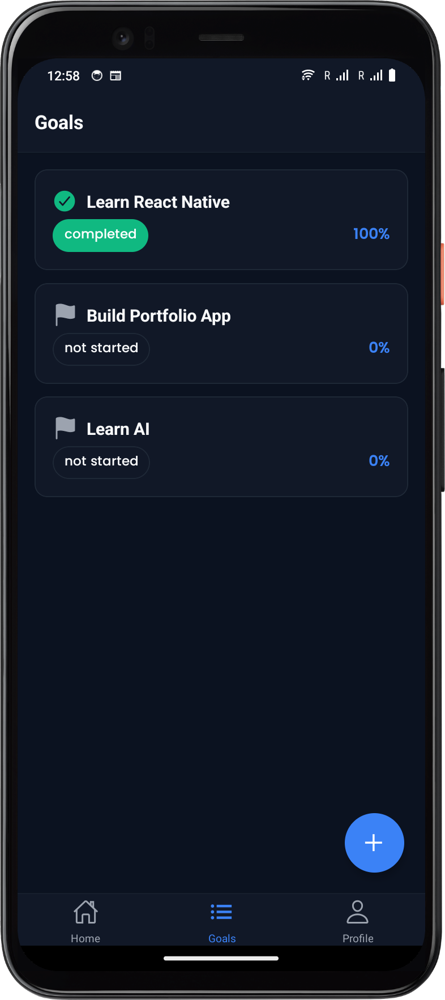 |
| **Goal Detail** | 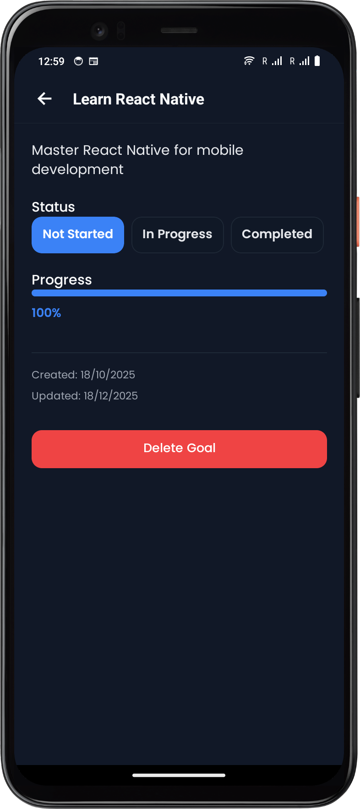 |
| **Profile Screen** | 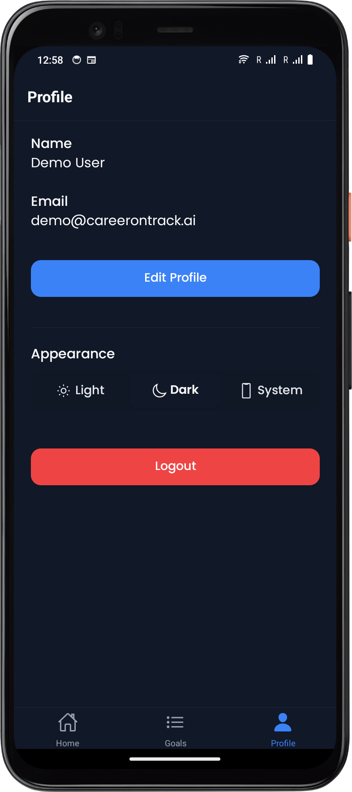 |

### Demo Credentials

```
Email: demo@careerontrack.ai
Password: demo123
```

---

## Architecture

### Project Structure

```text
mobile/
├── src/
│   ├── components/          # Reusable UI components
│   │   ├── ui/             # Generic UI components (Button, Input, Badge, Card, Label)
│   │   ├── TopBar.tsx      # Navigation header component
│   │   ├── ErrorBoundary.tsx
│   │   └── LoadingSpinner.tsx
│   ├── context/            # React Context providers
│   │   └── AuthContext.tsx # Authentication state management
│   ├── navigation/         # Navigation configuration
│   │   ├── AppNavigator.tsx # Main navigation setup
│   │   └── types.ts        # Navigation type definitions
│   ├── screens/            # Screen components
│   │   ├── LoginScreen.tsx
│   │   ├── HomeScreen.tsx
│   │   ├── GoalsScreen.tsx
│   │   ├── GoalDetailScreen.tsx
│   │   └── ProfileScreen.tsx
│   ├── services/           # API service layer
│   │   └── api.ts          # Axios-based API client
│   └── theme/              # Theming system
│       ├── ThemeProvider.tsx    # Theme context provider
│       ├── theme.ts             # Theme type definitions
│       ├── useThemedStyles.ts   # Themed styling hook
│       └── tokens/              # Design tokens
│           ├── colors.ts        # Color palette
│           ├── spacing.ts       # Spacing scale
│           ├── typography.ts    # Typography system
│           ├── radius.ts        # Border radius tokens
│           └── shadows.ts       # Shadow definitions
├── assets/
│   └── fonts/              # Poppins font family
├── App.tsx                 # Root component
├── app.json                # Expo configuration
└── package.json

```

---

## Thought Process

### Why Component-Based Implementation?

#### Scalability Benefits

* **Development Velocity**: Reusability allows us to "write once, use everywhere." A single `Button` component is used across 15+ instances, ensuring rapid prototyping.
* **Maintainability**: Design updates or bug fixes in a component propagate automatically to all usages, providing a single source of truth.
* **Quality**: Standardized components ensure consistent accessibility features and interaction patterns across the entire application.

### How Theming & Tokenization Helps

* **User Experience**: Support for Dark Mode reduces eye strain, while System Theme adaptation respects user OS preferences.
* **Design Consistency**: Tokenization eliminates "magic numbers." Instead of hardcoding `20px`, we use `theme.spacing.xl`, ensuring the design system is strictly enforced.
* **Future-Proofing**: Changing the primary brand color or adjusting the border-radius across the entire app is as simple as updating a single token file.

---

## Assessment Overview

### Fixes

#### 1. Static Hash Password Fix

* **Issue**: The backend stored an incorrect bcrypt hash for the demo password "demo123", preventing successful login.
* **Resolution**: Identified the incorrect hash in `backend/models/data.js` and updated it with the correct bcrypt hash.
* **Impact**: Enabled successful authentication flow for the demo user.

---

### Tasks Overview

#### ✅ Task 1: Login Screen

* **Objective**: Connect the login button to the API.
* **Implementation**: Connected the existing UI to the `AuthContext` and API service. Added form validation, loading states, and error handling to provide a professional user experience.

#### ✅ Task 2: Goals List

* **Objective**: Fetch and display goals from the API.
* **Implementation**: Integrated API calls to fetch user goals. Used the standardized `Card` and `Badge` components to display goal titles, progress, and statuses with pull-to-refresh functionality.

#### ✅ Task 3: Navigation

* **Objective**: Connect authentication state to navigation.
* **Implementation**: Implemented conditional rendering in the root navigator. If a user is authenticated, they are shown the Main App stack; otherwise, they are directed to the Login screen.

---

### Bonus Features

* **Home Screen Dashboard**: Visualized stats for "In Progress" and "Completed" goals.
* **New Goal Creation**: Added a Floating Action Button (FAB) and a Bottom Sheet modal for a modern creation experience.
* **Comprehensive Theming**: Built a full provider supporting Light, Dark, and System modes with persistent storage.
* **Custom Typography**: Integrated the Poppins font family for a premium look and feel.
* **Reusable UI Library**: Developed a library of custom buttons, inputs, and cards to replace all inline styling.

---

**Built with ❤️ using React Native, Expo, and TypeScript**

---